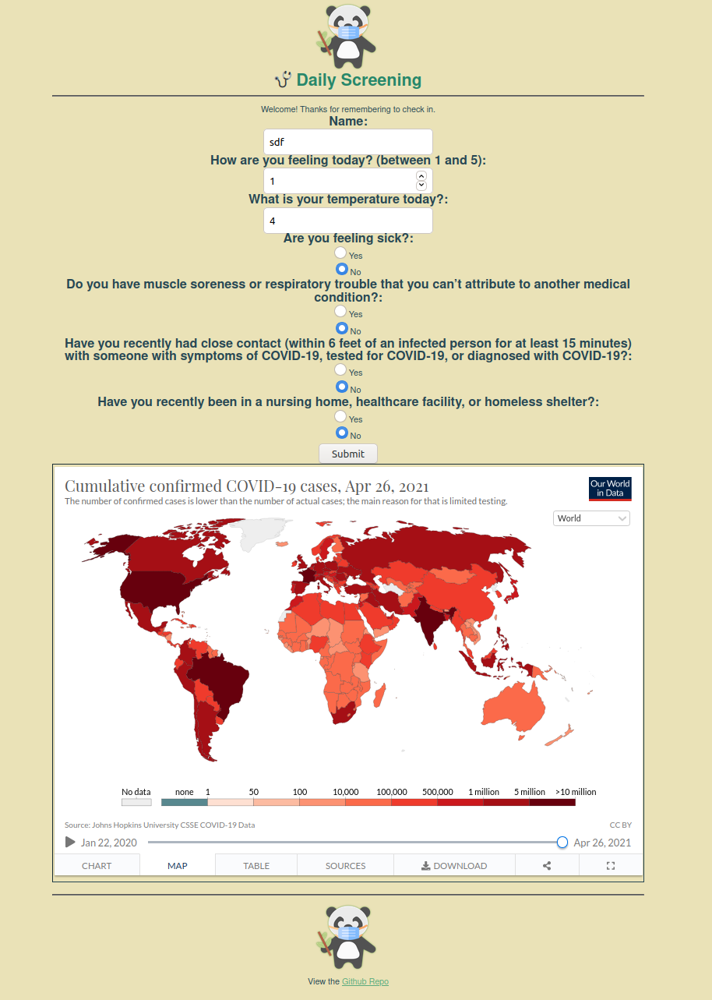
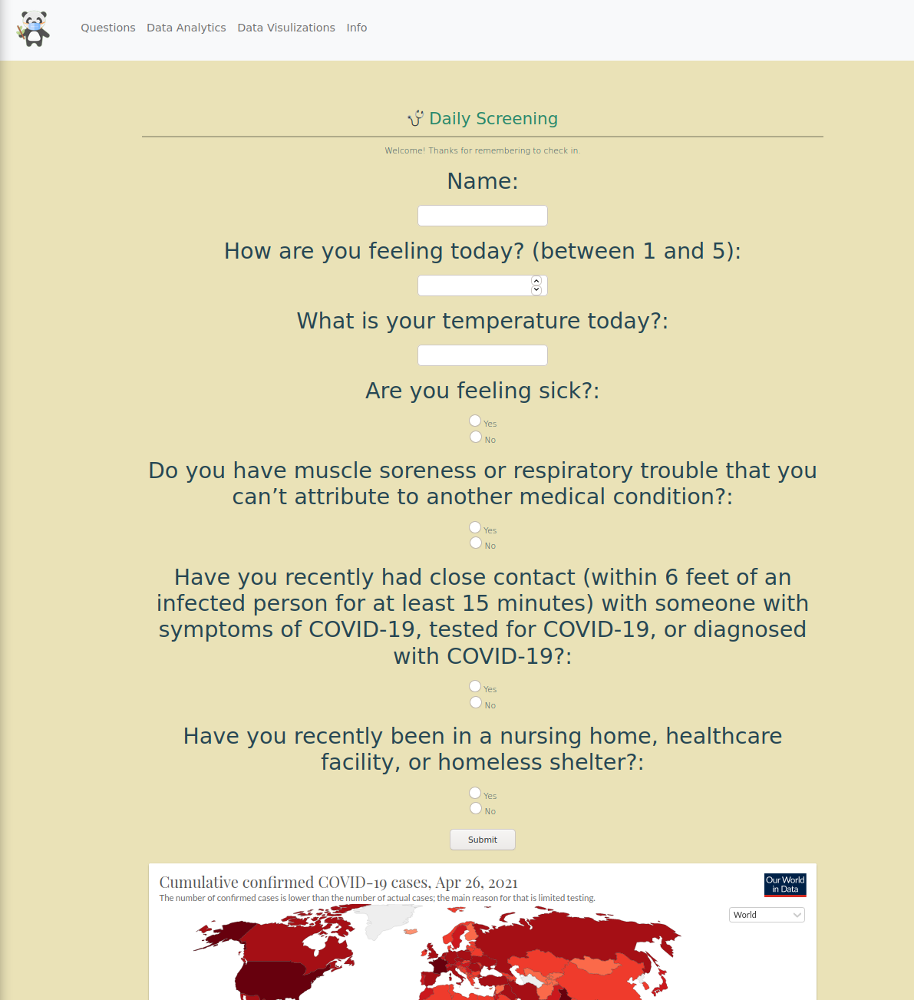
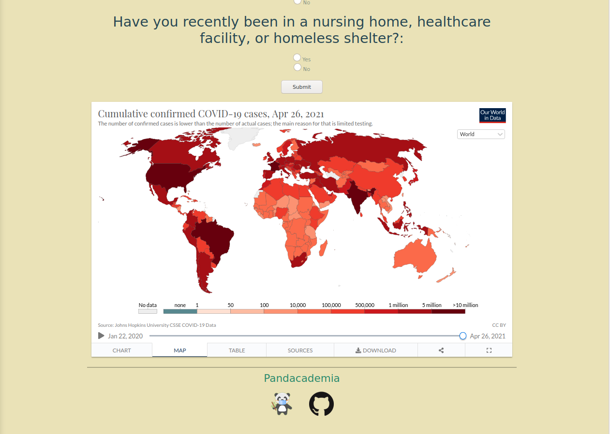

# Pandacademia
[](https://github.com/AOrps/Pandacademia/actions/workflows/go.yml)

## Background 

This project aims to innovate current university screening methodologies to make them
* More engaging for students
* Support efforts to educate the student body about COVID-19
* And provide more insight for universities about student health

## Objective
Our overarching goal is to support pandemic management within academia.

**pandemic + academia = Pandacademia!**

## Technologies
* Golang-Go
* Nginx
* Bootstrap
* numpy
* pandas
* matplotlib
* Github

## Usage

### Golang Version :sunglasses: (Future design / testing)
* With `Make`
```sh
cd test/
make run
```
* Without `Make`
```sh
cd test/
go build main.go
./main
```

### <!--Cringe --> Legacy Python :frowning:
```sh
cd src/
python3 main.py
```


## Considerations
We wanted to include these data visualizations created by Jing Huo, but embeds were blocked so we weren't able to.
https://colab.research.google.com/drive/1Hevj4QlZUzTOwBiTdwBUGzCWtS-MX87m?usp=sharing

* Temperature input as fahrenheit

## Version 
### Python3, Flask


### Golang, Bootstrap
* Top of Root Page

* Bottom of Root Page
